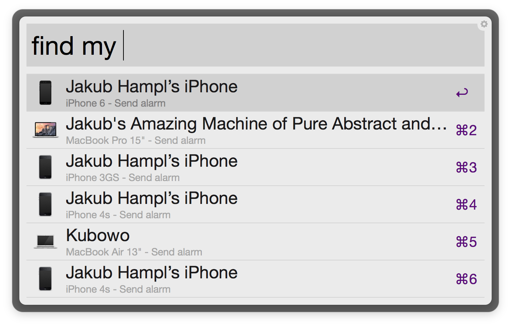

# Alfred! Where's my iPhone!?

This [Alfred](https://www.alfredapp.com/) workflow allows you to quickly find your
missing iPhone (or other Apple device) by typing `find my iphone` and hitting enter.
Quickly you should hear a very loud noise coming from you phone, so you can quickly
locate it.

### How it works?

After installing you will need to run `find my authenticate <icloud id> <icloud password>`
to set it up. It will then fetch a list of your devices from the Find my iPhone iCloud
server. If you hit enter it will use that server to send that device a loud audio
signal. You can also hit cmd-enter to go straight to the Find my iPhone website
where you can see your devices on a map.
